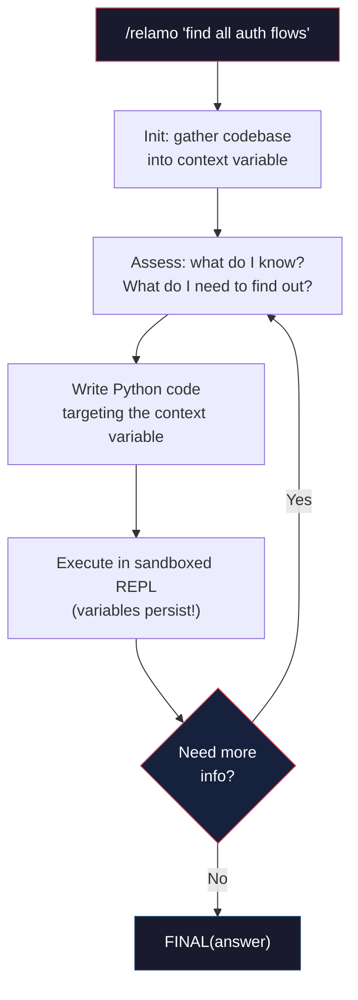

<div align="center">

# ReLaMo

**Recursive Language Model skill for AI coding agents — programmatic codebase exploration via persistent Python REPL**

[](LICENSE)
[]()
[](https://agentskills.io)
[](https://github.com/anthropics/claude-code)
[](https://github.com/google-gemini/gemini-cli)
[](https://github.com/openai/codex)
[](https://python.org)
[](https://docs.astral.sh/uv/)

Ever hit a wall exploring large codebases with AI?<br>
That's what happens when your tools can only read one file at a time.

[Installation](#installation) • [Usage](#when-to-use-what) • [The Problem](#the-problem) • [How It Works](#how-it-works) • [Examples](#real-world-scenarios)

</div>

relamo implements the **Recursive Language Model (RLM)** pattern as an [Agent Skills](https://agentskills.io) standard skill, supported across all major AI coding agents. Instead of stuffing files into prompts, it concatenates your codebase into a Python variable and lets the agent write code to search, extract, and analyze it iteratively — with full state persistence across REPL iterations.

## Installation

relamo uses the [Agent Skills open standard](https://agentskills.io) (`SKILL.md` format), supported across all major AI coding agents.

<table>
<tr>
  <th width="200">Platform</th>
  <th>How to install</th>
</tr>
<tr>
  <td><strong>Claude Code</strong></td>
  <td><code>claude plugin marketplace add ph3on1x/relamo</code><br><code>claude plugin install relamo</code></td>
</tr>
<tr>
  <td><strong>Gemini CLI</strong></td>
  <td><code>gemini extensions install &lt;github-url&gt;</code></td>
</tr>
<tr>
  <td><strong>Codex CLI</strong></td>
  <td>Clone the repo, then run <code>./scripts/setup-platforms.sh</code></td>
</tr>
<tr>
  <td><strong>Cursor</strong></td>
  <td>Auto-discovers skills — no setup needed if Claude Code plugin is installed. Otherwise, run <code>./scripts/setup-platforms.sh</code></td>
</tr>
</table>

> [!NOTE]
> Requires Python 3.11+ (managed automatically by uv) and [uv](https://docs.astral.sh/uv/) (auto-installs the `dill` dependency). The core REPL loop (`search()`, `extract_file()`, `list_files()`, `FINAL()`) works on all platforms. `llm_query()` and `recursive_llm()` require `claude` CLI in PATH — on platforms without it, these functions return an error message while the rest of the skill remains fully functional.

## When to Use What

<table>
<tr>
  <th width="280">You're thinking...</th>
  <th width="280">Use</th>
  <th>What happens</th>
</tr>
<tr>
  <td>"How does auth work in this 200-file project?"</td>
  <td><code>/relamo "how does auth work?"</code></td>
  <td>Gathers codebase, explores iteratively via REPL, returns structured answer with evidence</td>
</tr>
<tr>
  <td>"Find all API endpoints and their handlers"</td>
  <td><code>/relamo "find all API endpoints"</code></td>
  <td>Regex searches, extracts files, maps routes to handlers across the entire codebase</td>
</tr>
<tr>
  <td>"Compare error handling patterns across modules"</td>
  <td><code>/relamo "compare error handling"</code></td>
  <td>Batch-processes files, uses <code>llm_query()</code> for sub-analysis, synthesizes findings</td>
</tr>
<tr>
  <td>"I need to analyze just one subdirectory"</td>
  <td><code>/relamo "analyze auth" --context src/auth</code></td>
  <td>Scopes the REPL context to just that directory</td>
</tr>
</table>

### Arguments

<table>
<tr>
  <th width="200">Argument</th>
  <th width="120">Default</th>
  <th>Description</th>
</tr>
<tr>
  <td><code>&lt;query&gt;</code></td>
  <td>required</td>
  <td>The question or task to answer</td>
</tr>
<tr>
  <td><code>--context &lt;path&gt;</code></td>
  <td>current directory</td>
  <td>Path to codebase directory or single file</td>
</tr>
<tr>
  <td><code>--depth &lt;1-3&gt;</code></td>
  <td>1</td>
  <td>Max recursion depth for <code>recursive_llm()</code></td>
</tr>
<tr>
  <td><code>--iterations &lt;max&gt;</code></td>
  <td>15</td>
  <td>Max REPL loop iterations</td>
</tr>
</table>

## The Problem

AI coding agents are great at reading individual files. But when you need to understand how an entire codebase fits together:

- **Context window limits** — large codebases don't fit in a single prompt
- **No state between tool calls** — each file read starts from scratch
- **No batch processing** — you can't programmatically map an operation across 50 files

## How It Works



The entire codebase lives outside the prompt as a Python string. The agent writes code to interact with it — `search()`, `extract_file()`, `llm_query()` — accumulating findings in variables across iterations. This is the [RLM pattern](https://arxiv.org/abs/2307.00522) brought to AI coding agents as a skill.

The REPL engine (`scripts/repl.py`) is a [uv](https://docs.astral.sh/uv/) single-file script with [PEP 723](https://peps.python.org/pep-0723/) inline metadata. No manual dependency installation needed — `uv run` handles everything.

1. **Init** — gathers your codebase via `git ls-files` (or directory walk), skips binaries and large files, concatenates everything with `=== path ===` delimiters
2. **Execute** — runs Python code in a namespace where `context` and helpers are pre-loaded; state persists via [dill](https://github.com/uqfoundation/dill) serialization
3. **Loop** — the agent assesses, writes code, executes, reads output, and decides whether to continue or call `FINAL()`

### Available Functions

<table>
<tr>
  <th width="280">Function</th>
  <th>Purpose</th>
</tr>
<tr><td><code>context</code></td><td>Full concatenated codebase as string</td></tr>
<tr><td><code>list_files()</code></td><td>All file paths in context</td></tr>
<tr><td><code>extract_file(path)</code></td><td>Extract single file content by path</td></tr>
<tr><td><code>search(pattern, context_chars=200)</code></td><td>Regex search with surrounding context</td></tr>
<tr><td><code>llm_query(prompt)</code></td><td>LLM completion via <code>claude -p</code> (requires Claude CLI)</td></tr>
<tr><td><code>llm_query_batched(prompts)</code></td><td>Sequential LLM calls on a list of prompts</td></tr>
<tr><td><code>recursive_llm(query, sub_context)</code></td><td>Spawn child RLM instance (requires Claude CLI)</td></tr>
<tr><td><code>FINAL(answer)</code></td><td>Emit final answer and terminate</td></tr>
<tr><td><code>FINAL_VAR(var_name)</code></td><td>Emit a variable as the answer</td></tr>
<tr><td><code>config</code></td><td>Mutable safety config dict</td></tr>
</table>

## Example Session

### Exploring authentication

```
> /relamo "how does authentication work in this project?"

[relamo] Gathering codebase from: /Users/you/project
[relamo] Context size: 245,891 characters (241,003 bytes)
[relamo] Files included: 87

--- Iteration 1: Orient ---
files = list_files()
auth_files = [f for f in files if 'auth' in f.lower()]
print(auth_files)
# ['src/auth/middleware.ts', 'src/auth/providers.ts', 'src/auth/session.ts', ...]

--- Iteration 2: Extract key files ---
middleware = extract_file('src/auth/middleware.ts')
print(middleware[:2000])

--- Iteration 3: Analyze with LLM ---
analysis = llm_query(f"Explain the auth flow in this middleware:\n{middleware}")
print(analysis)

--- Iteration 4: Search for usage ---
results = search(r'requireAuth|isAuthenticated|withAuth')
print(f"Found {len(results)} usages across codebase")

--- Iteration 5: Synthesize ---
FINAL(f"Authentication uses JWT tokens via {analysis}...")

## RLM Result
### Answer
Authentication uses JWT tokens with a middleware chain...
### Evidence
src/auth/middleware.ts:15 — token validation
src/auth/providers.ts:42 — OAuth provider config
...
```

## Real-World Scenarios

### Onboarding to a large codebase

```
> /relamo "give me a high-level architecture overview of this project"

The REPL lists all files, groups them by directory, identifies key entry points,
extracts package.json/config files, and uses llm_query() to summarize each layer.
Returns a structured overview with the tech stack, data flow, and key patterns.
```

### Batch analysis across files

```
> /relamo "find all TODO and FIXME comments, categorize by priority and module"

The REPL searches for TODO/FIXME patterns across every file, extracts surrounding
context, uses llm_query() to classify each by priority, and returns a sorted report
grouped by module — something that would take dozens of manual Grep calls.
```

### Deep dive with recursive LLM

```
> /relamo "how does data flow from API request to database write?" --depth 2

The REPL identifies the API layer, then spawns recursive_llm() sub-instances to
independently analyze the routing layer, validation layer, and database layer.
Each child REPL gets a focused subset of the codebase. Results are merged into
a complete data flow analysis with evidence from each layer.
```

## Safety and Cost

### Guardrails

<table>
<tr>
  <th width="200">Parameter</th>
  <th width="120">Default</th>
  <th>Description</th>
</tr>
<tr><td><code>recursion_limit</code></td><td>1</td><td>Max depth for <code>recursive_llm()</code></td></tr>
<tr><td><code>max_iterations</code></td><td>15</td><td>REPL loop cap</td></tr>
<tr><td><code>timeout_seconds</code></td><td>120</td><td>Per LLM call timeout</td></tr>
<tr><td><code>max_output_chars</code></td><td>10,000</td><td>Stdout truncation limit</td></tr>
<tr><td><code>max_file_size</code></td><td>1 MB</td><td>Skip individual files larger than this</td></tr>
<tr><td><code>max_context_bytes</code></td><td>50 MB</td><td>Total codebase size limit</td></tr>
</table>

All values are adjustable at runtime via the `config` dict.

### Sandboxing

The REPL runs in a restricted environment:
- **Blocked builtins**: `eval`, `exec`, `compile` are removed
- **Import whitelist**: only `re`, `json`, `math`, `collections`, `itertools`, `functools`, `textwrap`, `difflib`, `hashlib`, `datetime`, `csv`, `io`, `os.path`, `pathlib`, `string`, `unicodedata`

## Acknowledgments

- **MIT CSAIL** — The [Recursive Language Model](https://arxiv.org/abs/2307.00522) research paper this plugin implements
- **Anthropic** — [Claude Code](https://github.com/anthropics/claude-code) and the [Agent Skills standard](https://agentskills.io)

## License

[MIT](LICENSE)
